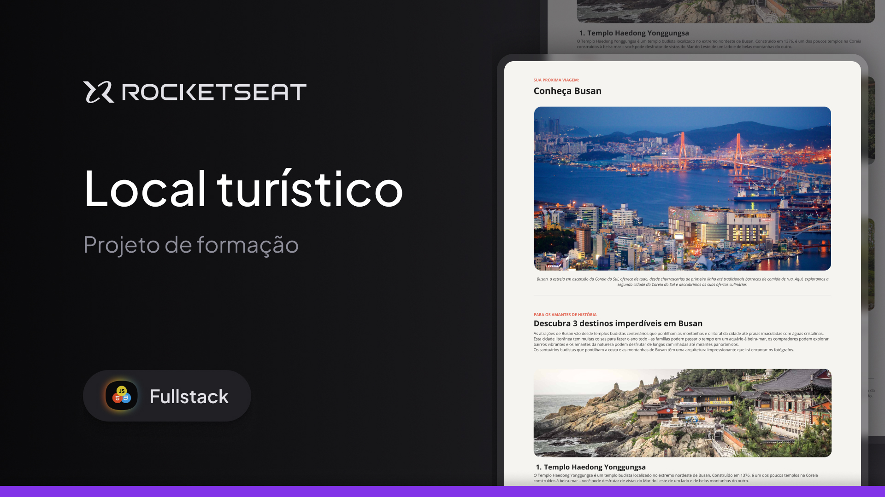

<h1 align="center">Local Turístico </h1>

Esse projeto foi desenvolvido no curso Full Stack da Rocketseat!

  <a href="#-tecnologias">Tecnologias</a>&nbsp;&nbsp;&nbsp;|&nbsp;&nbsp;&nbsp;
  <a href="#-projeto">Projeto</a>&nbsp;&nbsp;&nbsp;|&nbsp;&nbsp;&nbsp;
  <a href="#-layout">Layout</a>&nbsp;&nbsp;&nbsp;|&nbsp;&nbsp;&nbsp;
  <a href="#memo-licença">Licença</a>

  

 

## 🚀 Tecnologias! 

Esse projeto foi desenvolvido com as seguintes tecnologias:

- HTML e CSS
- Git e Github
- Figma

## 💻 Projeto

Busan Travel Guide 🌏

Este é um projeto que criei como parte de uma atividade opcional do curso da Rocketseat. Trata-se de um guia turístico que destaca 3 destinos imperdíveis em Busan, Coreia do Sul. O guia apresenta informações sobre:

Templo Haedong Yonggungsa 🛕
Templo Beomeo-sa 🛕
Parque Yongdusan 🌳

O foco do projeto foi praticar HTML e CSS, criando uma página visualmente agradável que apresenta informações sobre esses pontos turísticos de forma clara e organizada.

## 🔖 Layout

Você pode visualizar o layout do projeto através [DESSE LINK](https://www.figma.com/design/DcF1nrdrNc7MaMzf5gJe8U/Local-Tur%C3%ADstico-(Community)?m=auto&t=GYqbnkBG4Ql2iQVh-6). É necessário ter conta no [Figma](https://figma.com) para acessá-lo.

## 🌌 Ver Site 
Confira aqui: https://luisfelipets17.github.io/guia-turistico/

## :memo: Licença

Esse projeto está sob a licença MIT.

---